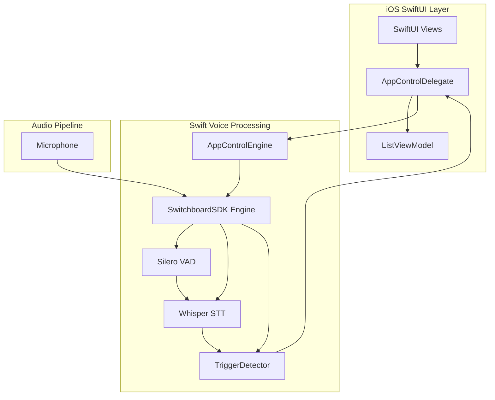

import GithubEmbed from '@site/src/components/GithubEmbed';
import Screenshot from '@site/src/components/Screenshot';

## About

This example demonstrates how to build a voice-controlled iOS application using SwitchboardSDK with real-time speech recognition. The app showcases navigation and interaction with UI elements through voice commands, combining Whisper STT (Speech-to-Text) and Silero VAD (Voice Activity Detection) for accurate and responsive voice control. Users can navigate through a movie list, like/dislike items, expand descriptions, and jump to specific items by speaking their names.

### Architecture Overview

The application uses SwitchboardSDK's audio processing pipeline to create a seamless voice control experience. The architecture consists of:

1. **Audio Processing Pipeline** - Configurable audio graph with microphone input, voice activity detection, and speech recognition
2. **Swift Voice Processing Engine** - Native trigger detection and keyword matching system
3. **SwiftUI Interface** - Modern iOS interface with reactive voice command feedback



### Project Structure

```
AppControlExample/
├── AppControl/
│   ├── AppControlExample.swift      # Swift implementation with SwitchboardSDK integration
│   ├── TriggerDetector.swift        # Swift trigger detection and command processing
│   ├── AppControlView.swift         # Main SwiftUI view
│   ├── ListView.swift               # Movie list UI components
│   ├── DataModels.swift             # Data models and sample movie data
│   └── AudioGraph.json              # Audio processing pipeline configuration
├── AppControlExampleApp.swift       # App entry point with SDK initialization

scripts/
└── setup.sh                        # Framework download and setup script
```

### Code Implementation

#### Audio Graph Configuration

The audio processing pipeline is defined in `AudioGraph.json`, creating a real-time speech recognition system:

```json
{
  "type": "RealTimeGraphRenderer",
  "config": {
    "microphoneEnabled": true,
    "graph": {
      "config": {
        "sampleRate": 16000,
        "bufferSize": 512
      },
      "nodes": [
        {
          "id": "multiChannelToMonoNode",
          "type": "MultiChannelToMono"
        },
        {
          "id": "busSplitterNode",
          "type": "BusSplitter"
        },
        {
          "id": "vadNode",
          "type": "SileroVAD.SileroVAD",
          "config": {
            "frameSize": 512,
            "threshold": 0.5,
            "minSilenceDurationMs": 40
          }
        },
        {
          "id": "sttNode",
          "type": "Whisper.WhisperSTT",
          "config": {
            "initializeModel": true,
            "useGPU": true
          }
        }
      ],
      "connections": [
        {
          "sourceNode": "inputNode",
          "destinationNode": "multiChannelToMonoNode"
        },
        {
          "sourceNode": "multiChannelToMonoNode",
          "destinationNode": "busSplitterNode"
        },
        {
          "sourceNode": "busSplitterNode",
          "destinationNode": "vadNode"
        },
        {
          "sourceNode": "busSplitterNode",
          "destinationNode": "sttNode"
        },
        {
          "sourceNode": "vadNode.end",
          "destinationNode": "sttNode.transcribe"
        }
      ]
    }
  }
}
```

#### SwitchboardSDK Integration

The app initializes SwitchboardSDK with required extensions in `AppControlExampleApp.swift`:

```swift
@main
struct AppControlExampleApp: App {

    init() {
        SBSwitchboardSDK.initialize(withAppID: "YOUR_APP_ID", appSecret: "YOUR_APP_SECRET")
        SBWhisperExtension.initialize(withConfig: [:])
        SBSileroVADExtension.initialize(withConfig: [:])
    }

    var body: some Scene {
        WindowGroup {
            AppControlView()
        }
    }
}
```

#### Voice Command Processing Engine

The Swift implementation handles voice command detection and processing:

```swift
// AppControlExample.swift
@objc enum TriggerType: Int {
    case next, back, like, dislike, expand, runtimeTriggers, unknown
}

// Keywords organized by trigger type
private static var triggerKeywords: [TriggerType: [String]] = [
    .next: ["next", "forward", "skip", "down"],
    .back: ["back", "last", "previous", "up"],
    .like: ["like", "favourite", "heart"],
    .dislike: ["dislike", "dont like", "do not like"],
    .expand: ["expand", "details", "open"],
    .runtimeTriggers: []
]

// Engine creation and event handling
func createEngine() {
    guard let filePath = Bundle.main.path(forResource: "AudioGraph", ofType: "json"),
          let jsonString = try? String(contentsOfFile: filePath, encoding: .utf8)
    else {
        print("Error reading JSON file")
        return
    }

    guard let jsonData = jsonString.data(using: .utf8),
          let config = try? JSONSerialization.jsonObject(with: jsonData) as? [String: Any]
    else {
        print("Error parsing JSON")
        return
    }

    let createEngineResult = Switchboard.createEngine(withConfig: config)
    engineID = createEngineResult.value! as String
    
    // Listen for transcription events
    let listenerResult = Switchboard.addEventListener("sttNode", eventName: "transcription") { [weak self] eventData in
        guard let self = self,
              let transcriptionText = eventData as? String else { return }

        let result = TriggerDetector.detectTrigger(transcriptionText)
        
        if result.detected {
            DispatchQueue.main.async {
                self.delegate?.triggerDetected(result.triggerType.rawValue, withKeyword: result.keyword)
            }
        }
    }
}
```

#### SwiftUI Voice Control Interface

The SwiftUI interface provides reactive updates based on voice commands:

```swift
// AppControlView.swift
class AppControlDelegate: NSObject, ControlDelegate, ObservableObject {
    @Published var detectedKeyword = ""
    weak var verticalListViewModel: ListViewModel?

    func triggerDetected(_ triggerType: Int, withKeyword keyword: String) {
        guard let mode = TriggerType(rawValue: triggerType) else { return }

        DispatchQueue.main.async {
            self.detectedKeyword = keyword

            switch mode {
            case .next:
                self.verticalListViewModel?.goNext()
            case .back:
                self.verticalListViewModel?.goBack()
            case .like:
                self.verticalListViewModel?.toggleLike()
            case .dislike:
                self.verticalListViewModel?.toggleDislike()
            case .expand:
                self.verticalListViewModel?.toggleExpand()
            case .runtimeTriggers:
                // Find movie by title and select it
                if let movieIndex = self.verticalListViewModel?.items.firstIndex(where: {
                    $0.title.lowercased() == keyword
                }) {
                    self.verticalListViewModel?.selectItem(at: movieIndex)
                }
            }
        }
    }
}
```

#### Text Processing and Trigger Detection

The system includes sophisticated text processing for accurate command recognition:

```swift
// Clean function removes punctuation and normalizes text
static func clean(_ phrase: String) -> String {
    var input = phrase
    
    // Remove patterns like [text], (text), *text*
    let pattern = "\\[[^\\]]*\\]|\\([^\\)]*\\)|\\*[^*]*\\*"
    input = input.replacingOccurrences(of: pattern, with: "", options: .regularExpression)
    
    // Trim whitespace
    input = trim(input)
    
    // Convert to lowercase
    input = input.lowercased()
    
    // Remove punctuation
    input = input.components(separatedBy: CharacterSet.punctuationCharacters).joined()
    
    return input
}

// Trigger detection finds longest matching keywords
static func detectTrigger(_ phrase: String) -> TriggerResult {
    let cleanedPhrase = clean(phrase)
    var bestLength = 0
    var bestTriggerType: TriggerType = .unknown
    var bestKeyword = ""
    
    for (triggerType, keywords) in triggerKeywords {
        let match = findLongestMatch(cleanedPhrase, keywords: keywords)
        if !match.isEmpty && match.count > bestLength {
            bestTriggerType = triggerType
            bestLength = match.count
            bestKeyword = match
        }
    }
    
    let detected = bestLength > 0
    return TriggerResult(triggerType: bestTriggerType, keyword: bestKeyword, detected: detected)
}
```

## Example Features

### Voice Navigation Commands

Navigate through the interface using natural speech:

```swift
// Supported navigation commands
"next", "forward", "skip", "down"    // Navigate to next item
"back", "last", "previous", "up"     // Navigate to previous item
```

### Voice Action Commands

Interact with content using voice:

```swift
// Action commands
"like", "favourite", "heart"         // Like current item
"dislike", "don't like"             // Dislike current item
"expand", "details", "open"         // Expand item description
```

### Runtime Voice Triggers

Jump directly to specific content by name:

```swift
// Set runtime triggers with movie titles
let movieTitles = DataSource.shared.movieData.map { $0.title }
example?.setRuntimeTriggers(movieTitles)

// Users can say movie titles to jump directly to them
"Dune", "Matrix", "Avatar", "Inception"
```

### Real-Time Voice Feedback

Visual feedback for recognized commands:

```swift
struct AppControlView: View {
    var body: some View {
        VStack {
            Text("Voice Control Demo")
                .font(.title)

            Text(delegate.detectedKeyword)
                .fontWeight(.semibold)
                .font(.callout)
                .frame(minHeight: 20)

            ListView(viewModel: verticalListViewModel)
        }
    }
}
```

### Voice Activity Detection

Optimized voice detection using Silero VAD:

```json
{
  "id": "vadNode",
  "type": "SileroVAD.SileroVAD",
  "config": {
    "frameSize": 512,
    "threshold": 0.5,
    "minSilenceDurationMs": 40
  }
}
```

### Speech Recognition Configuration

Whisper STT configuration for accurate transcription:

```json
{
  "id": "sttNode",
  "type": "Whisper.WhisperSTT",
  "config": {
    "initializeModel": true,
    "useGPU": true
  }
}
```

### Audio Processing Pipeline

The audio processing flow ensures low-latency voice recognition:

1. **Microphone Input** → Capture audio at 16kHz
2. **Multi-Channel to Mono** → Convert stereo to mono for processing
3. **Bus Splitter** → Split audio for parallel VAD and STT processing
4. **Voice Activity Detection** → Detect speech start/end points
5. **Speech Recognition** → Convert speech to text when voice activity detected
6. **Trigger Processing** → Match text against command keywords
7. **UI Updates** → Execute corresponding actions in SwiftUI interface

### Custom Trigger Keywords

Add new voice commands by extending the trigger system:

```swift
// Add new trigger types
@objc enum TriggerType: Int {
    case next, back, like, dislike, expand
    case customAction  // New custom action
    case runtimeTriggers, unknown
}

// Add corresponding keywords
private static var triggerKeywords: [TriggerType: [String]] = [
    .customAction: ["custom", "special", "action"],
    // ... existing keywords
]
```

### Engine Lifecycle Management

Control the voice recognition engine lifecycle:

```swift
// Engine management
func startEngine() {
    let startEngineResult = Switchboard.callAction(withObjectID: engineID, actionName: "start", params: nil)
    if startEngineResult.error != nil {
        print("Failed to start audio engine: \(startEngineResult.error?.localizedDescription ?? "Unknown error")")
    }
}

func stopEngine() {
    let stopEngineResult = Switchboard.callAction(withObjectID: engineID, actionName: "stop", params: nil)
    if stopEngineResult.error != nil {
        print("Failed to stop audio engine: \(stopEngineResult.error?.localizedDescription ?? "Unknown error")")
    }
}
```

## Source Code

<GithubEmbed link="https://github.com/switchboard-sdk/voice-app-control-example-ios">
    Voice-Controlled iOS App with SwitchboardSDK
</GithubEmbed>
