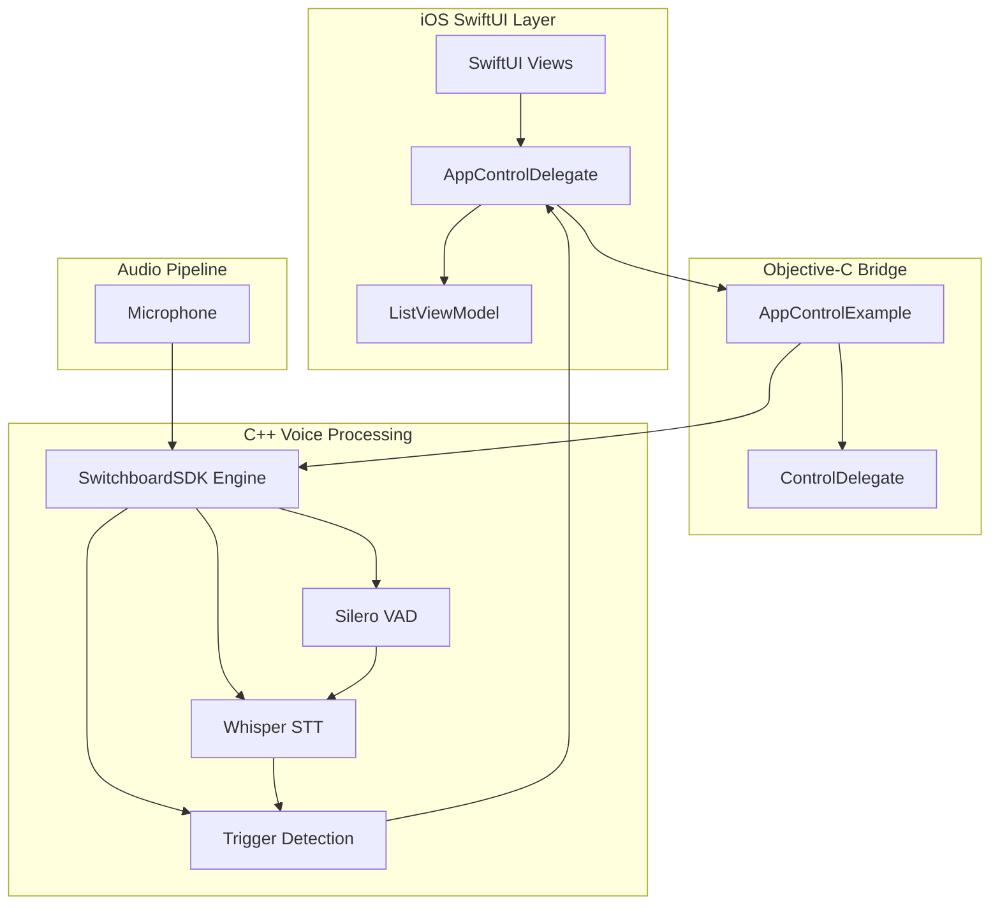

import GithubEmbed from '@site/src/components/GithubEmbed';
import Screenshot from '@site/src/components/Screenshot';

## About

This example demonstrates how to build a voice-controlled iOS application using SwitchboardSDK with real-time speech recognition. The app showcases navigation and interaction with UI elements through voice commands, combining Whisper STT (Speech-to-Text) and Silero VAD (Voice Activity Detection) for accurate and responsive voice control. Users can navigate through a movie list, like/dislike items, expand descriptions, and jump to specific items by speaking their names.

### Architecture Overview

The application uses SwitchboardSDK's audio processing pipeline to create a seamless voice control experience. The architecture consists of:

1. **Audio Processing Pipeline** - Configurable audio graph with microphone input, voice activity detection, and speech recognition
2. **C++ Voice Processing Engine** - Custom trigger detection and keyword matching system
3. **SwiftUI Interface** - Modern iOS interface with reactive voice command feedback
4. **Objective-C Bridge** - Seamless integration between C++ SwitchboardSDK and Swift UI



### Code Implementation

#### Audio Graph Configuration

The audio processing pipeline is defined in `AudioGraph.json`, creating a real-time speech recognition system:

```json
{
  "type": "RealTimeGraphRenderer",
  "config": {
    "microphoneEnabled": true,
    "graph": {
      "config": {
        "sampleRate": 16000,
        "bufferSize": 512
      },
      "nodes": [
        {
          "id": "multiChannelToMonoNode",
          "type": "MultiChannelToMono"
        },
        {
          "id": "busSplitterNode",
          "type": "BusSplitter"
        },
        {
          "id": "vadNode",
          "type": "SileroVAD.SileroVAD",
          "config": {
            "frameSize": 512,
            "threshold": 0.5,
            "minSilenceDurationMs": 40
          }
        },
        {
          "id": "sttNode",
          "type": "Whisper.WhisperSTT",
          "config": {
            "initializeModel": true,
            "useGPU": true
          }
        }
      ],
      "connections": [
        {
          "sourceNode": "inputNode",
          "destinationNode": "multiChannelToMonoNode"
        },
        {
          "sourceNode": "multiChannelToMonoNode",
          "destinationNode": "busSplitterNode"
        },
        {
          "sourceNode": "busSplitterNode",
          "destinationNode": "vadNode"
        },
        {
          "sourceNode": "busSplitterNode",
          "destinationNode": "sttNode"
        },
        {
          "sourceNode": "vadNode.end",
          "destinationNode": "sttNode.transcribe"
        }
      ]
    }
  }
}
```

#### SwitchboardSDK Integration

The app initializes SwitchboardSDK with required extensions in `AppControlExampleApp.swift`:

```swift
@main
struct AppControlExampleApp: App {
    
    init() {
        SBSwitchboardSDK.initialize(withAppID: "YOUR_APP_ID", appSecret: "YOUR_APP_SECRET")
        SBWhisperExtension.initialize(withConfig: [:])
        SBSileroVADExtension.initialize(withConfig: [:])
    }
    
    var body: some Scene {
        WindowGroup {
            AppControlView()
        }
    }
}
```

#### Voice Command Processing Engine

The C++ implementation handles voice command detection and processing:

```cpp
// AppControlExample.mm
enum TriggerType {
   NEXT, BACK, LIKE, DISLIKE, EXPAND, RUNTIME_TRIGGERS, UNKNOWN
};

// Keywords organized by trigger type
static std::map<TriggerType, std::vector<std::string>> triggerKeywords = {
    {TriggerType::NEXT, {"next", "forward", "skip", "down"}},
    {TriggerType::BACK, {"back", "last", "previous", "up"}},
    {TriggerType::LIKE, {"like", "favourite", "heart"}},
    {TriggerType::DISLIKE, {"dislike", "dont like", "do not like"}},
    {TriggerType::EXPAND, {"expand", "details", "open"}},
    {TriggerType::RUNTIME_TRIGGERS, {/* populated at runtime */}}
};

// Engine creation and event handling
- (void)createEngine {
    NSString *filePath = [[NSBundle mainBundle] pathForResource:@"AudioGraph" ofType:@"json"];
    NSString *jsonString = [NSString stringWithContentsOfFile:filePath encoding:NSUTF8StringEncoding error:&error];
    
    const char* config = [jsonString UTF8String];
    Result<Switchboard::ObjectID> result = Switchboard::createEngine(std::string(config));
    engineID = result.value();

    // Listen for transcription events
    Switchboard::addEventListener("sttNode", "transcription", [weakSelf](const std::any& data) {
        const auto text = Config::convert<std::string>(data);
        std::string cleaned = clean(text);
        
        TriggerType triggerType;
        std::string detectedKeyword;
        
        if (detectTrigger(cleaned, triggerType, detectedKeyword)) {
            NSString* keyword = [NSString stringWithUTF8String:detectedKeyword.c_str()];
            dispatch_async(dispatch_get_main_queue(), ^{
                [strongSelf.delegate triggerDetected:(NSInteger)triggerType withKeyword:keyword];
            });
        }
    });
}
```

#### SwiftUI Voice Control Interface

The SwiftUI interface provides reactive updates based on voice commands:

```swift
// AppControlView.swift
class AppControlDelegate: NSObject, ControlDelegate, ObservableObject {
    @Published var detectedKeyword = ""
    weak var verticalListViewModel: ListViewModel?
    
    func triggerDetected(_ triggerType: Int, withKeyword keyword: String) {
        guard let mode = TriggerType(rawValue: triggerType) else { return }
        
        DispatchQueue.main.async {
            self.detectedKeyword = keyword
            
            switch mode {
            case .next:
                self.verticalListViewModel?.goNext()
            case .back:
                self.verticalListViewModel?.goBack()
            case .like:
                self.verticalListViewModel?.toggleLike()
            case .dislike:
                self.verticalListViewModel?.toggleDislike()
            case .expand:
                self.verticalListViewModel?.toggleExpand()
            case .runtimeTriggers:
                // Find movie by title and select it
                if let movieIndex = self.verticalListViewModel?.items.firstIndex(where: { 
                    $0.title.lowercased() == keyword 
                }) {
                    self.verticalListViewModel?.selectItem(at: movieIndex)
                }
            }
        }
    }
}
```

#### Text Processing and Trigger Detection

The system includes sophisticated text processing for accurate command recognition:

```cpp
// Clean function removes punctuation and normalizes text
static std::string clean(const std::string& phrase) {
    std::regex pattern(R"(\[[^\]]*\]|\([^\)]*\)|\*[^*]*\*)");
    std::string input = std::regex_replace(phrase, pattern, "");
    input = trim(input);
    std::transform(input.begin(), input.end(), input.begin(), ::tolower);
    input.erase(std::remove_if(input.begin(), input.end(), ::ispunct), input.end());
    return input;
}

// Trigger detection finds longest matching keywords
bool detectTrigger(const std::string& phrase, TriggerType& outMode, std::string& outKeyword) {
    size_t bestLength = 0;
    TriggerType bestTriggerType = TriggerType::UNKNOWN;
    std::string bestKeyword;

    for (const auto& [triggerType, keywords] : triggerKeywords) {
        std::string match = findLongestMatch(phrase, keywords);
        if (!match.empty() && match.length() > bestLength) {
            bestTriggerType = triggerType;
            bestLength = match.length();
            bestKeyword = match;
        }
    }
    
    return bestLength > 0;
}
```

## Example Features

### Voice Navigation Commands

Navigate through the interface using natural speech:

```swift
// Supported navigation commands
"next", "forward", "skip", "down"    // Navigate to next item
"back", "last", "previous", "up"     // Navigate to previous item
```

### Voice Action Commands

Interact with content using voice:

```swift
// Action commands
"like", "favourite", "heart"         // Like current item
"dislike", "don't like"             // Dislike current item  
"expand", "details", "open"         // Expand item description
```

### Runtime Voice Triggers

Jump directly to specific content by name:

```swift
// Set runtime triggers with movie titles
let movieTitles = DataSource.shared.movieData.map { $0.title }
example?.setRuntimeTriggers(movieTitles)

// Users can say movie titles to jump directly to them
"Dune", "Matrix", "Avatar", "Inception"
```

### Real-Time Voice Feedback

Visual feedback for recognized commands:

```swift
struct AppControlView: View {
    var body: some View {
        VStack {
            Text("Voice Control Demo")
                .font(.title)
            
            Text(delegate.detectedKeyword)
                .fontWeight(.semibold)
                .font(.callout)
                .frame(minHeight: 20)
            
            ListView(viewModel: verticalListViewModel)
        }
    }
}
```

### Voice Activity Detection

Optimized voice detection using Silero VAD:

```json
{
  "id": "vadNode",
  "type": "SileroVAD.SileroVAD",
  "config": {
    "frameSize": 512,
    "threshold": 0.5,
    "minSilenceDurationMs": 40
  }
}
```

### Speech Recognition Configuration

Whisper STT configuration for accurate transcription:

```json
{
  "id": "sttNode",
  "type": "Whisper.WhisperSTT",
  "config": {
    "initializeModel": true,
    "useGPU": true
  }
}
```

### Audio Processing Pipeline

The audio processing flow ensures low-latency voice recognition:

1. **Microphone Input** → Capture audio at 16kHz
2. **Multi-Channel to Mono** → Convert stereo to mono for processing
3. **Bus Splitter** → Split audio for parallel VAD and STT processing
4. **Voice Activity Detection** → Detect speech start/end points
5. **Speech Recognition** → Convert speech to text when voice activity detected
6. **Trigger Processing** → Match text against command keywords
7. **UI Updates** → Execute corresponding actions in SwiftUI interface

### Custom Trigger Keywords

Add new voice commands by extending the trigger system:

```cpp
// Add new trigger types
enum TriggerType {
    NEXT, BACK, LIKE, DISLIKE, EXPAND, 
    CUSTOM_ACTION,  // New custom action
    RUNTIME_TRIGGERS, UNKNOWN
};

// Add corresponding keywords
static std::map<TriggerType, std::vector<std::string>> triggerKeywords = {
    {TriggerType::CUSTOM_ACTION, {"custom", "special", "action"}},
    // ... existing keywords
};
```

### Engine Lifecycle Management

Control the voice recognition engine lifecycle:

```objc
// Engine management
- (void)startEngine {
    auto startEngineResult = Switchboard::callAction(engineID, "start");
}

- (void)stopEngine {
    auto stopEngineResult = Switchboard::callAction(engineID, "stop");
}
```

## Source Code

<GithubEmbed link="https://github.com/switchboard-sdk/voice-app-control-example-ios">
    Voice-Controlled iOS App with SwitchboardSDK
</GithubEmbed>